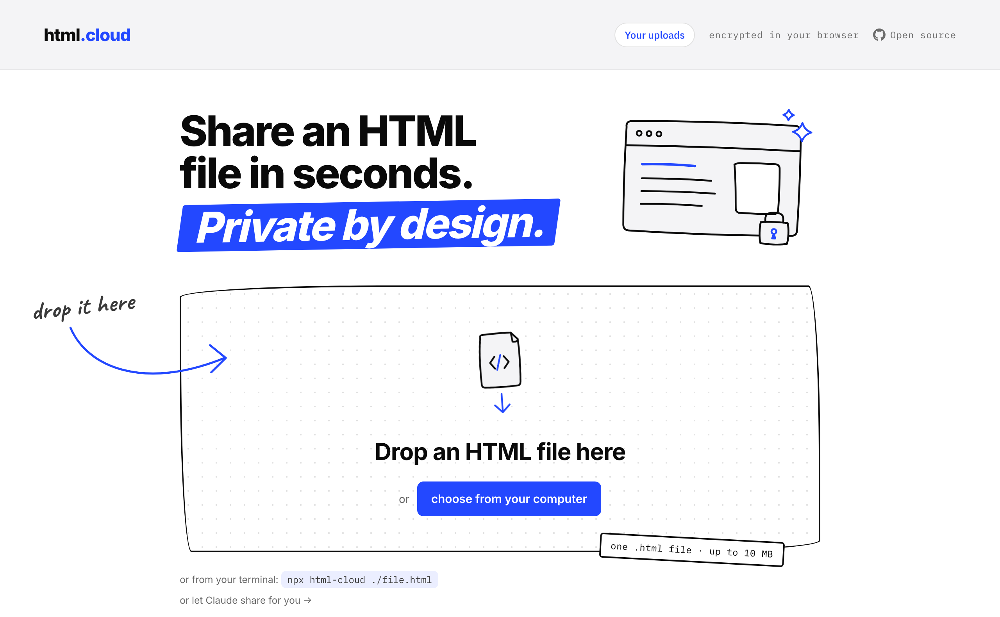

<p align="center">
  <a href="https://html.cloud">
    
  </a>
</p>

<h1 align="center">html.cloud</h1>

<p align="center">
  <strong>Share an HTML file. Keep the key.</strong><br>
  Zero-knowledge, end-to-end encrypted HTML file sharing.
</p>

<p align="center">
  <a href="https://html.cloud">html.cloud</a> ·
  <a href="https://www.npmjs.com/package/html-cloud">npm</a> ·
  <a href="https://html.cloud/security">Security</a> ·
  <a href="https://html.cloud/cli">CLI</a> ·
  <a href="https://html.cloud/mcp">MCP</a>
</p>

<p align="center">
  <a href="https://html.cloud">
    
  </a>
</p>

Your browser encrypts the file with AES-256-GCM before anything is uploaded. The decryption key lives after the `#` in the share URL — browsers never send that part to the server. We store only ciphertext.

## How it works

1. Drop an HTML file on the homepage
2. Your browser generates two random keys: a **view key** (AES-256-GCM) and an **edit key**
3. The file is encrypted in-browser and uploaded as ciphertext
4. You get two links:
   - **Share link** `/v/{id}#viewKey` — give this to anyone you want to read the file
   - **Edit link** `/e/{id}#editKey` — keep this private; it lets you replace the file, change its expiry, or delete it without changing the share link
5. Files self-destruct after the chosen expiry (7 days, 30 days, or never — 30 days by default)

The server stores:
- The encrypted blob
- The view key encrypted with the edit key (so the edit page can re-encrypt without exposing the view key)
- `SHA-256(editKey)` for authorization — never the plaintext keys

## Security properties

- **Zero-knowledge uploads** — the server cannot read any uploaded content
- **Key-in-fragment** — browsers strip the URL fragment before sending HTTP requests; the key never reaches the server
- **Edit authorization** — only `SHA-256(editKey)` is stored; the raw `edit_key` is verified on every write request (replace, expiry, settings, delete)
- **Expiry enforcement** — expired documents are invisible to every route and hard-deleted daily by `model:prune`
- **10 MB upload limit** enforced server-side
- **No accounts** — the API is stateless; every state-mutating request is authorized by the edit key, and uploads are rate-limited

See [html.cloud/security](https://html.cloud/security) for the full write-up.

## CLI

Share a file from the terminal — encrypted locally, same crypto module as the browser:

```bash
npx html-cloud ./file.html
```

Or pipe straight from a generator:

```bash
my-report-tool | npx html-cloud -
```

The package lives in [`cli/`](cli/) and on [npm](https://www.npmjs.com/package/html-cloud).
See [html.cloud/cli](https://html.cloud/cli) for usage and options.

## MCP server

Let Claude (or any MCP client) share HTML for you. The server is published as `html-cloud-mcp` and lives in [`cli/mcp/`](cli/mcp/):

```json
{
  "mcpServers": {
    "html-cloud": {
      "command": "npx",
      "args": ["-y", "html-cloud-mcp"]
    }
  }
}
```

See [html.cloud/mcp](https://html.cloud/mcp) for setup instructions.

## Stack

- **Laravel 13** (PHP 8.4+)
- **SQLite** (swap to MySQL/Postgres via `.env` for production)
- **Vite 8** (CSS and JS build pipeline)
- **Web Crypto API** (all crypto is browser-native; no external crypto libraries)

## Setup

```bash
cp .env.example .env
php artisan key:generate
php artisan migrate
npm install && npm run build
php artisan serve
```

Run the test suite with:

```bash
php artisan test
```

For production, add a cron entry to run the scheduler:

```
* * * * * cd /path/to/html.cloud && php artisan schedule:run >> /dev/null 2>&1
```

## Self-hosting

Clone, configure `.env` (`APP_URL`, `DB_*` if using MySQL/Postgres), run behind nginx or Caddy. Everything, including the encrypted blobs, lives in the database — back that up and you have the whole state.

## License

[MIT](LICENSE)
